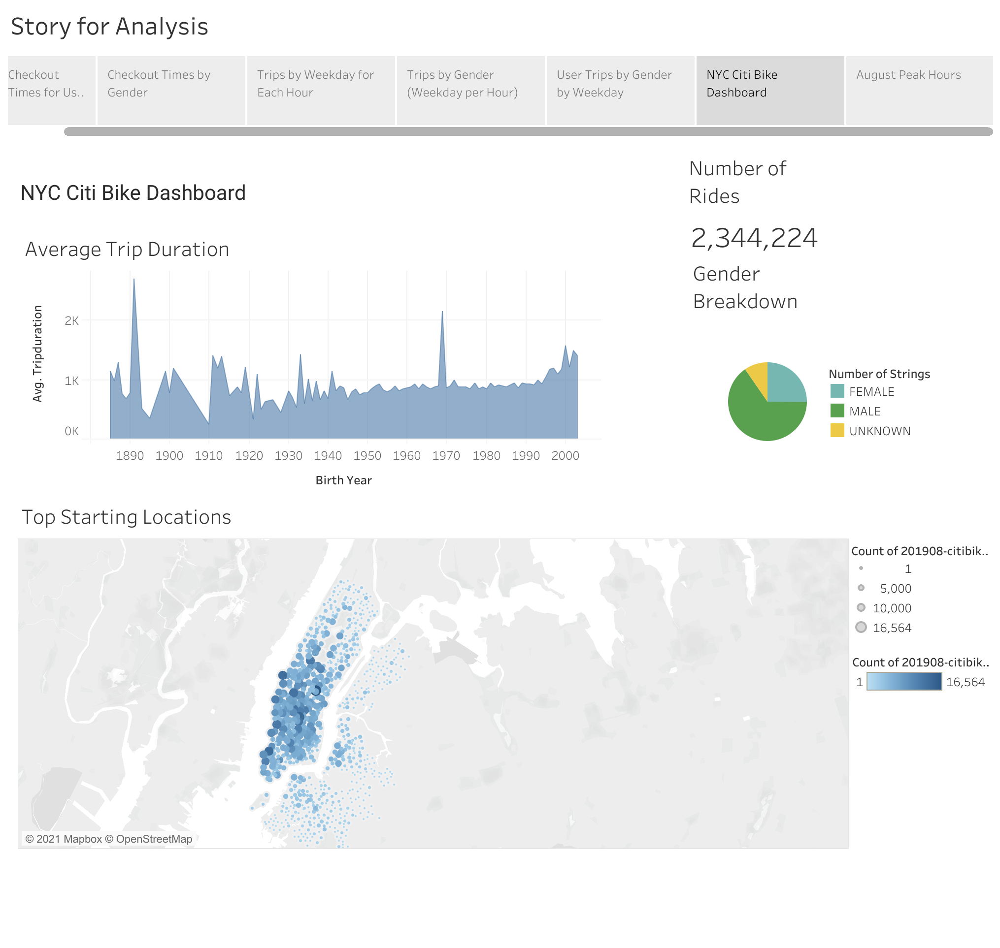
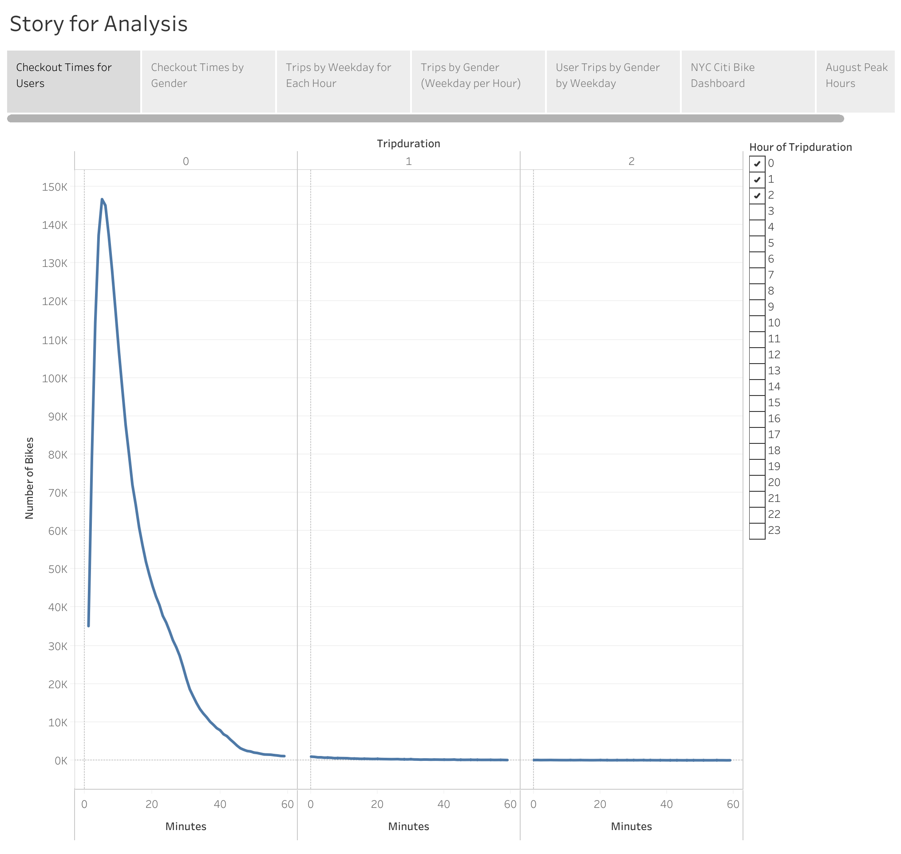
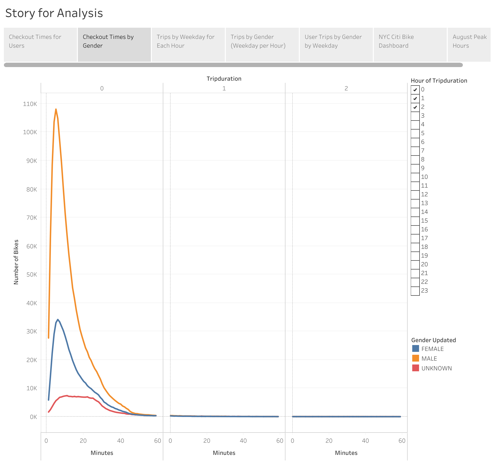
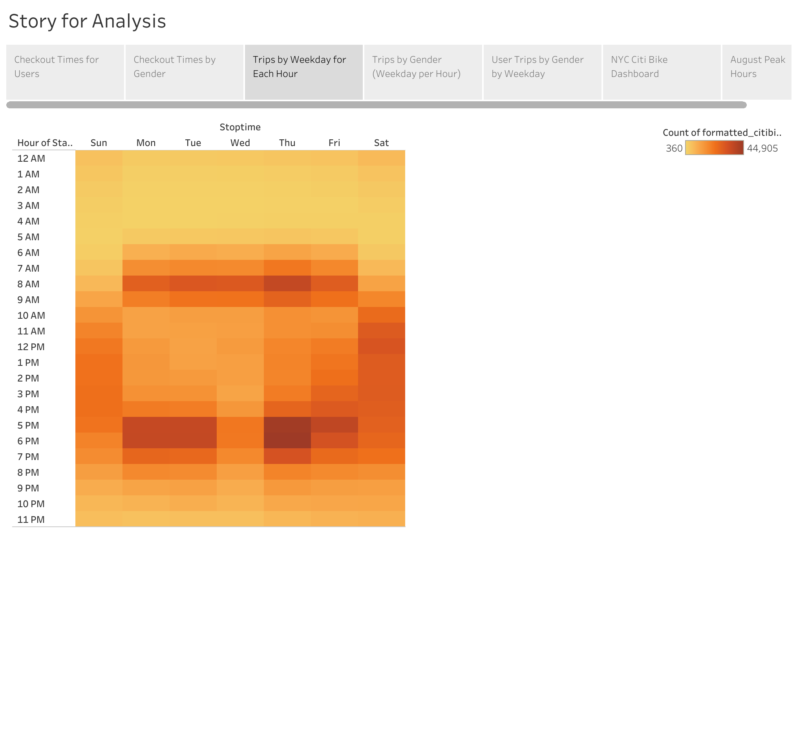
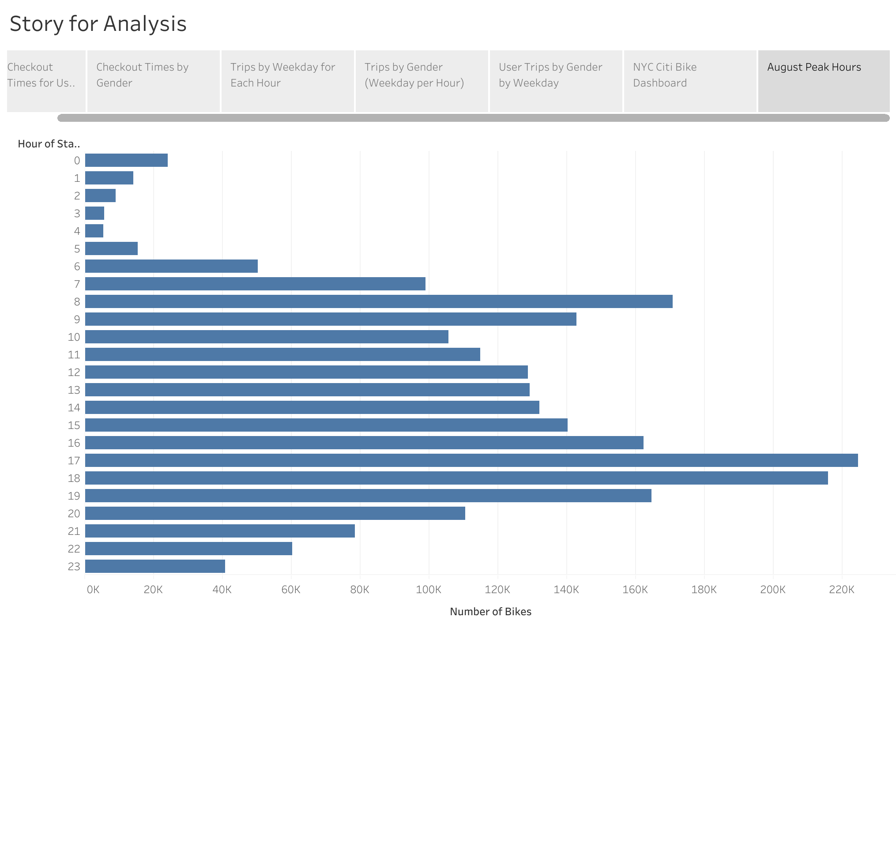
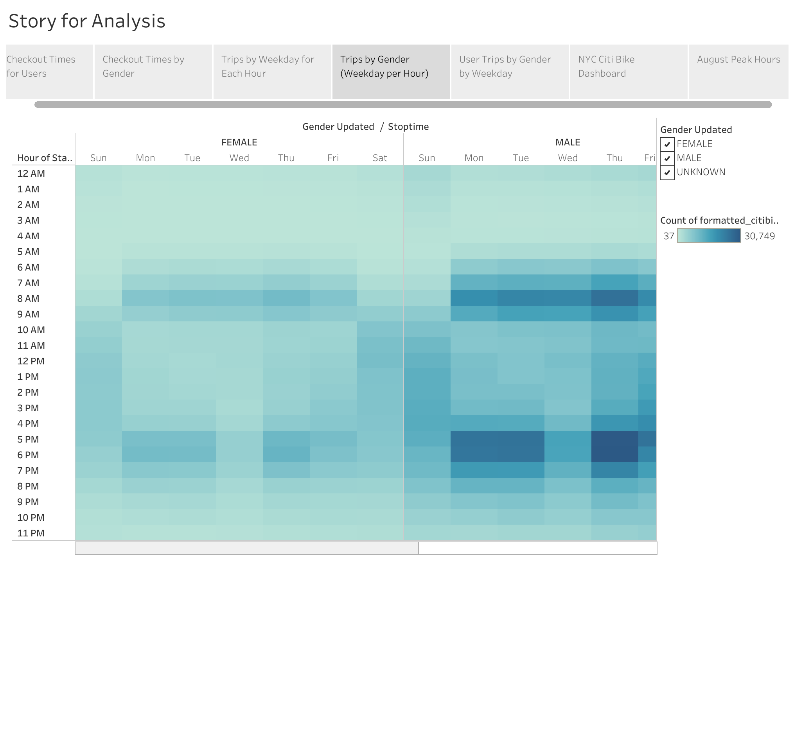
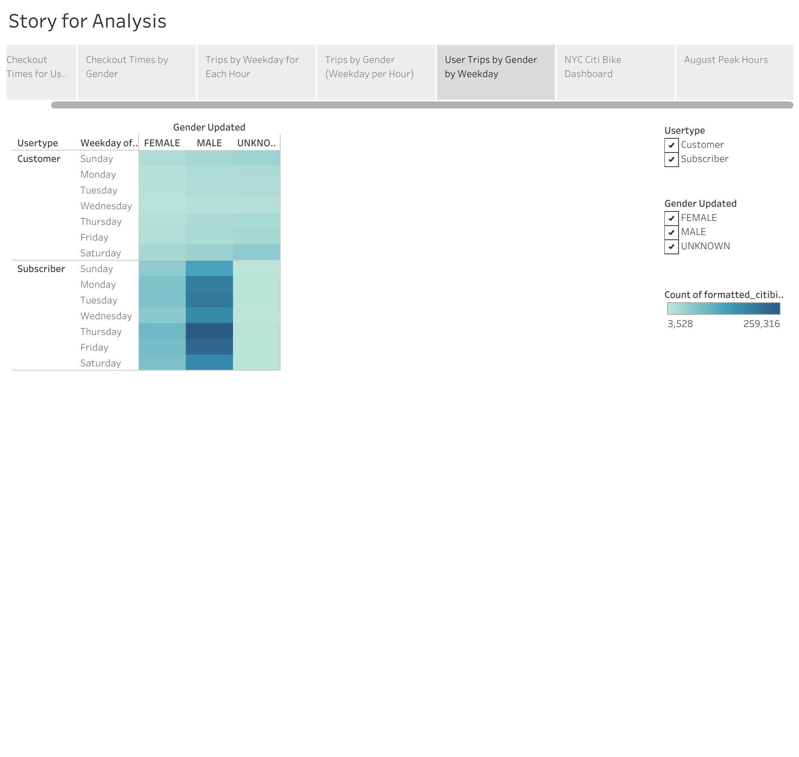

# Citi Bike Sharing Analysis 

## Overview of this Analysis 

- In this analysis I delve into the Citi bike database data I retrieve for August 2019. With this analysis using jupyter notebook I first inspect and format the raw data. I then transfer the data to Tableau where I create visualizations from the data. The Tableau visualizations intend to impress an angel investor to invest in a business in the city of Des Moines; mimicking the Citi bike business model.

## Results 

In this section of the analysis I go over the results of each of the visualizations I made. 

- This dashboard is a summary of the data. The total number of rides for August is 2,344,224, while the majority of the users using the Citi bike are male. The adults born after the 1940s use the bike more consistently compared to those born before the 1940s. There is also a figure showing the top starting locations of Citi bike users in New York City.

**Graph 1: NYC Citi Bike Dashboard**

- In this result the y-axis represents the number of bikes and the x-axis represents the total hours of the trip duration. We can see that the majority of the bikes were used less than an hour. 

**Graph 2: Checkout Times for Users**

- I conduct a similar analysis to the previous one with the gender filter applied. From this graph I can conclude that male's, then female's used the citi bikes the most; using the bikes for less than an hour. 

**Graph 3: Checkout Times by Gender**

- In this third analysis, I analyze the weekday trips for each hour using a heatmap. The results show that the most number of trips were made between 7 AM - 9 AM and 5 PM - 7 PM; this implies that the Citi bikes were used mostly to commute to work.

**Graph 4: Trips by Weekday for Each Hour**

- This result is similar analysis to the previous analysis with the gender filter applied. The peak hours for using the Citi bikes are similar to males using the bikes the most during the peak hours.

**Graph 5: Trips by Weekday for Each Hour**

- This result solely shows the number of bikes used in each hour of the day. We find a similar result where the peak hours were recorded from 8 AM-10 AM and 5 PM - 7 PM

**Graph 6: Trips by Gender (Weekday per Hour)**

- In this result, I filtered the data according to two conditions for the weekday: user type and gender. The results pronounce that male subscribers use the bikes the most throughout the week.

**Graph 7: User Trips by Gender by Weekday**

## Summary 

Overall from the 2,344,224 number of rides I can conclude that male subscribers use the Citi bike the most for less than an hour on each trip. Furthermore, the peak hours for these users are between 7 AM-9 AM and 5 PM-7 PM. From these results, we can set tentative targets until we have enough data to set true targets. However, we can set key performance indicators to assess our progress; this can be customer retention, number of hours used, and referral signups. I would suggest making a worksheet that draws the starting and ending location of the bikes used. This data can be used to put advertisements on the most frequently used routes. The second worksheet I will recommend is to draw a map of the places where bikes get pilled the most towards the end of the day.

The link of my Tableau Public space: 
[https://public.tableau.com/app/profile/abdullah.bera.kucuk/viz/Challenge_16311651986910/StoryforAnalysis?publish=yes](https://public.tableau.com/app/profile/abdullah.bera.kucuk/viz/Challenge_16311651986910/StoryforAnalysis?publish=yes)
